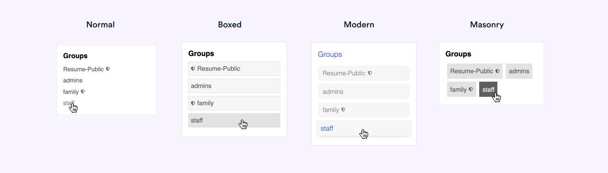

# 👪 Layouts Groups Widget

## 🔍 Overview

The Groups Widget allows each user to see what groups they are in on a sidebar using Pavilion's [Custom Layouts Plugin](https://meta.discourse.org/t/custom-layouts-plugin/55208). See the [installation guide](https://thepavilion.io/t/installation-and-setup/3200) to learn how to install and administer this widget.

## 🔗 Info &amp; Links

| Title                 | Link                                                                              |
| --------------------- | --------------------------------------------------------------------------------- |
| ⚙️ **Widget**         | [Layouts Groups Widget](https://github.com/paviliondev/layouts-groups-widget)     |
| 🔌 **Base Plugin**    | [Custom Layouts Widget](https://meta.discourse.org/t/custom-layouts-plugin/55208) |
| 👨‍💻 **Author**         | [Keegan George](https://github.com/keegangeorge/)                                 |
| #️⃣ **Version**        | `1.1.0`                                                                           |
| ❓ **How to Install** | [Installation Guide](https://thepavilion.io/t/installation-and-setup/3200)        |
| 🐛 **Found a bug?**   | [Submit a bug report](https://thepavilion.io/w/bug-report/steps/intro)            |
| ✋ **Have an idea?**  | [Submit a feature request](https://thepavilion.io/w/bug-report/steps/intro)       |

### ❓How it works

Once logged in, each user can see which groups they are part of. Users can click on the group to be directed to the corresponding group page. If a guest (a user not logged in) is looking at the widget, they will be able to see all public groups available on the forum. However, if no public groups are available, they will see a notice prompting them to login to see the groups.

## ⚙️ Settings

There are a couple settings that you can configure to customize how the groups widget appears in the layout.

### Show Header

Toggle this setting to show/hide the title header in the widget.

### Hidden Groups

Select which groups should be hidden from the widget.

### Style

The widget comes with some pre-installed theme styles. Select from the options in the dropdown to configure a unique style for the widget.

